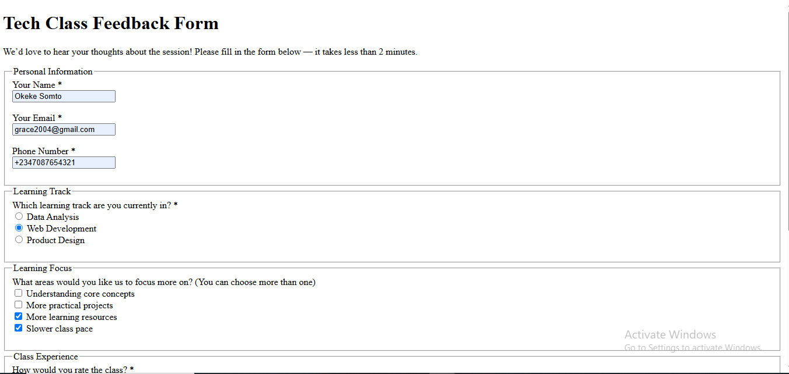
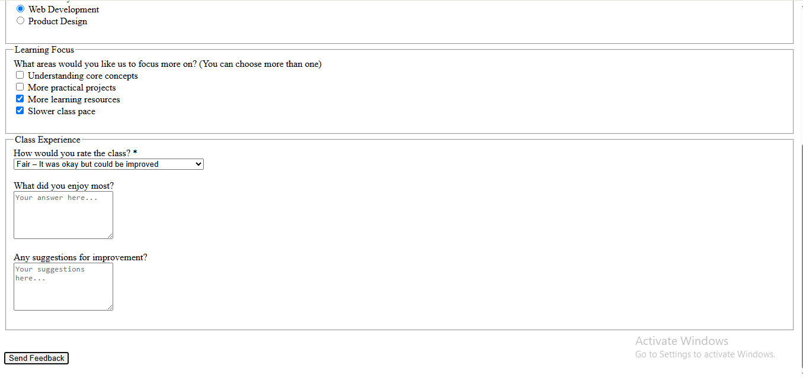

Task 2 – Contact Form 📝

This is a simple HTML feedback form.
It allows learners to submit structured feedback after a tech class session, including details like their learning track, satisfaction level, and suggestions for improvement.


🌐 Live Preview

> To test the form properly (including redirection), open it using Live Server in VS Code or host it via GitHub Pages.


🧩 Features

- Collects user info (Name, Email, Phone)
- Captures selected learning track (Radio buttons)
- Allows multiple improvement suggestions (Checkboxes)
- Feedback rating via dropdown
- Textarea for open feedback (likes & improvements)
- Clean redirect to a custom Thank You page after submission
- Accessible structure using `<fieldset>` and `<legend>`


📥 How It Works

The form uses [FormSubmit](https://formsubmit.co) to send form data to the developer’s email address without needing a backend.

```html
<form action="https://formsubmit.co/2be2614ebe443d0633258d9535adc64f" method="POST">
```

🔒 CAPTCHA is enabled to reduce spam.  
🚀 After submission, users are redirected to `Thankyou.html`.

🌐 Live Demo

[Click here to view the live feedback form](https://gracefulmara.github.io/task2-contactform/)

📸 Screenshots

📝 Feedback Form – Top Section


> This section of the form collects the user's name, email, and phone number, and allows them to select their learning track. Fieldsets and labels are used to improve structure and accessibility.

📝 Feedback Form – Continued


> This part of the form includes checkboxes for learning preferences, a dropdown rating system, and textareas for open-ended feedback. All fields are organized for clarity and user-friendliness.

✅ Thank You Page


> After submission, users are redirected to this confirmation page, acknowledging their feedback and closing the interaction on a positive note.


✅ What I Learned

- Structuring HTML forms semantically
- Using radio buttons, checkboxes, and dropdowns effectively
- How to redirect users after form submission
- Basics of working with Git & GitHub for version control


🛠️ Author

Grace Aronu  
[GitHub Profile →](https://github.com/GracefulMara)
---

📌 Note

This project is part of an ongoing learning process. Suggestions and feedback are welcome!